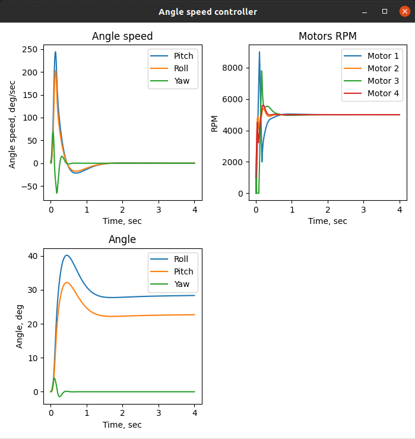

# Quadcopter_angle_controller
A small mathematical model, that shows the main principles of dual-circuit control. This model is continues Quadcopter_angle_speed_controller ideas. 
I add a new control circuit, that allow us to control angle. Because the coordinate is primitive of speed, we can control it by controlling speed.

The signal go through angle PID and turns into desire command for angle speed PID controller, then the signal go through mixer and go to motors.

So, we have this 

As we can see, it can control roll, yaw and pitch angles.

This model has some disadvantages:
1) There are no motor dynamics, we can change motor speed instantly. 
2) It need to be setted up by special methods, like Ziegler–Nichols method.

I will try to add motor dynamics, and instal autotuner in this system. If you need an extrat description you, look there https://github.com/der-rozanov/Quadcopter_angle_speed_controller. 
 
